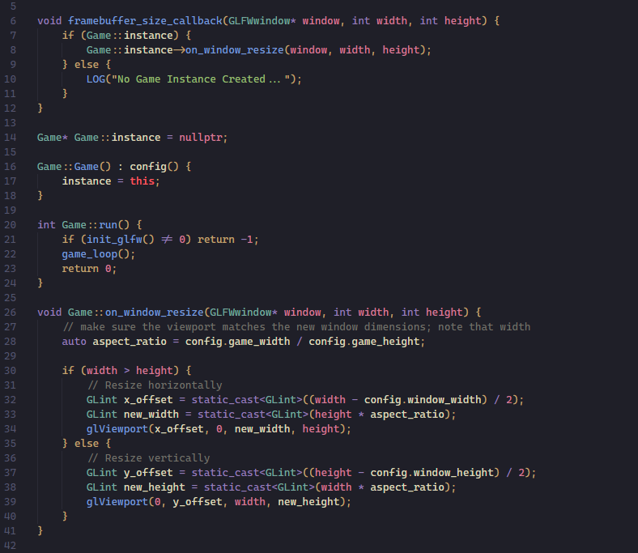

  <h2 align="center">🌊 KANAGAWA.vscode 🌊</h2>

VSCode dark colorscheme inspired by the colors found in the <a href="https://github.com/rebelot/kanagawa.nvim">KANAGAWA.nvim</a> repo.

  <h2 align="center"></h2>

## Installation

I did not upload this to the VSCode Extension Marketplace, so you will need to install manually!

1. Download the `.vsix` file found in the `package` folder
2. In a command line run `code --install-extension <path_to_vsix>`
    - The `code` command needs to be on your `PATH`, this should be an option when installing VSCode.
3. There may be a way to install directly from VSCode (without the `code` command, but I don't know it.)
